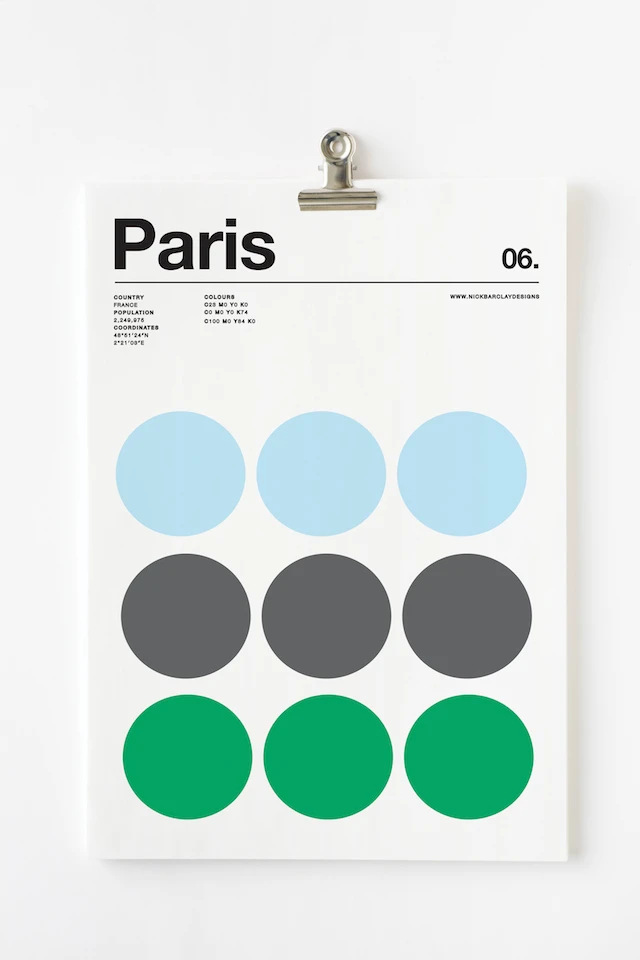

# CSS Clone Practice (8/31)

- flexbox
- flex-wrap
- Original
  
- my practice
  

### What to improve

#### HTML

- Use semantic tag : section -> header
- Use list

#### CSS

- natural shadow effect
- inherit
- flex-basis
- align-items : baseline, flex-start
- border-bottom
